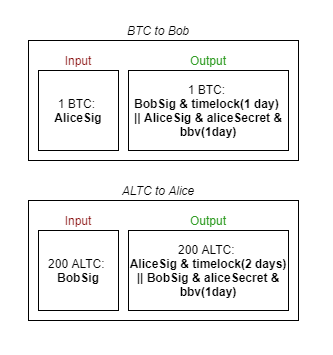

# Succinct Atomic Swaps With OP_BBV

Using two slightly asymmetric transactions each using timelocks and [OP_BEFOREBLOCKVERIFY](bip-beforeblockverify.md), the atomic swap can happen with a single transaction on each chain, and recovery can be done from a static seed without requiring backing up any additional state at any time.

## Comparison to SAS without OP_BBV

* Pros: 
  * Neither party needs to indefinitely watch the chain for a cheat transaction by the counterparty. 
  * Neither party needs to store/backup any state that can't be recovered from the seed.
* Cons:
  * Is not scriptless.
  * Requires timelocks on both chains and op_bbv on one chain.

[Ruben Somsen's SAS protocol](https://gist.github.com/RubenSomsen/8853a66a64825716f51b409be528355f) also only requires 2 transactions (1 per chain) in normal scenarios. However, it also requires one party to watch the blockchain for a potentially long period of time - until they want to spend the coins received in the swap. Also, backing up dynamic state is required to restore in the case of primary data loss because of the use of pre-signed transactions and exchanged secrets. 

## Transaction spend-paths

Note that the `bbv(2 days)` in the `Bob Revoke` transaction isn't strictly necessary, since aliceSecret should never be exposed after 1 day, however it is nice to close out the possibility that Alice might leak aliceSecret sometime in the future before she has spent her coins, which could allow Bob to steal her funds. 

## Cases

### Normal Case

1. Alice sends "BTC to Bob" transaction
2. Bob sends "ALTC to Alice" transaction
3. Wait 1 day.

### Bob doesn't send the ALTC after step 1

1. Alice sends "BTC to Bob" transaction
3. After say 6 hours, Alice sends a transaction using the ` Alice Revoke` spend-path.

### "Alice Revoke" after Bob sends "ALTC to Alice" in step 2

1. Alice sends "BTC to Bob" transaction
2. Bob sends "ALTC to Alice" transaction
3. After say 6 hours, Alice sends the Revoke transaction. This reveals `aliceSecret`.
4. Bob then sends "Bob Revoke".

### Notes on other hypothetical cases:

* Alice can't spend the `Alice Revoke` transaction after 1 day, so `aliceSecret` shouldn't ever be reveled after that point, and therefore `Bob Revoke` also can't be spent after 1 day. However, if `aliceSecret` was revealed, bob could steal the ALTC back

## Properties

* In normal cases, only two transactions needed in total - one on each chain.
* In failure cases, four transactions in total will be needed.
* In normal cases, the transaction can be considered complete by both parties after 1 day (or whatever the smaller timeout is). No watching is needed after that time. 
* Recovery normally does not require any secrets - recovery should be possible from just the seed. To do this, `aliceSecret` must be generated from the seed in a way that is regeneratable upon recovery from the seed.
* Alice must keep track of a secret for a period of time until either Bob sends the "ALTC to Alice" transaction (and it is confirmed) or until Alice sends the "Alice Revoke" transaction. In practice, this could take well under an hour (or some small fraction of whatever smaller timeout is chosen). 

